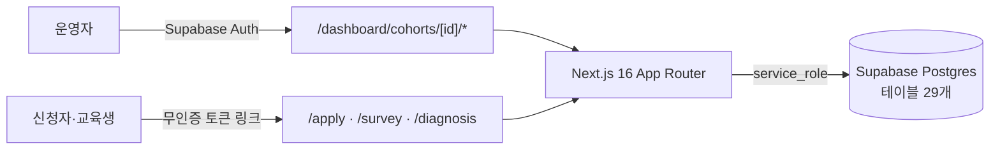

# KBrain EMS

AI·데이터 교육 사업의 운영 사이클 전체를 한 시스템에서 관리하는 교육 운영 관리 시스템.
모집 → 선발 → 수업 회차 → 출결 → 과제 → 수료 → 인증 → 설문 → 사전·사후 진단 → 결과보고서.

> **소스는 회사 자산이라 비공개입니다.** 이 저장소는 무엇을 · 왜 · 어떻게 만들었는지 기록한 사례 문서입니다. 코드는 면접 등에서 화면 공유로 설명할 수 있습니다.

## 왜 만들었나

처음에는 엑셀과 구글폼으로 운영했다. 기수가 하나일 때는 그걸로 충분했다.
사업이 확대되어 기수가 동시에 여러 개 돌아가고 운영자도 늘어나면서, 파일과 폼으로는 같은 데이터를 같은 상태로 유지하기 어려워졌다.
그래서 운영을 직접 하는 사람이 운영 전 과정을 한 시스템으로 옮겼다. 수료 기준·출결 인정 범위·인증 조건 같은 규칙은 운영하면서 이미 알고 있던 것을 그대로 코드로 옮겼다.

## 무엇이 들어 있나

| 영역 | 내용 |
|---|---|
| 기수 운영 | 모집 공고·신청서(PDF 첨부), 평가위원 선발, 수업 회차·장소, 출결(회차별), 과제(제출·평가) |
| 판정·발급 | 수료 판정, 인증, 결과보고서 자동 초안 |
| 응답 수집 | 만족도 설문(개별 토큰·카톡 공유 코드, 응답 익명화), 사전·사후 진단 — 로그인 없는 링크 |
| 강사·정산 | 강사풀, 회차별 강사 배정, 등급 단가 기반 강사료 산정·승인 |
| 사업 관리 | 사업 진척률·KPI, 리스크 등록부, 이슈 보드, 알림 발송 로그 |
| 운영자 | 기수를 먼저 고른 뒤 그 기수의 도메인을 관리. 사이드바는 기수 단계(모집·진행·종료)에 따라 메뉴를 바꿔 보여준다 |

## 아키텍처

## 규모

2026-09-16 대시보드 기준.

| 항목 | 값 |
|---|---|
| 누적 기수 | 41개 (진행 중 9개) |
| 누적 지원 | 8,180건 |
| 누적 선발 | 2,515건 |
| 누적 수료 | 1,449명 |
| Postgres 테이블 | 29개, 마이그레이션은 raw SQL |

## 스택

Next.js 16 · React · TypeScript · Tailwind + shadcn/ui · TanStack Query/Form · Supabase (Postgres + Auth) · Bun

## 더 읽을거리

라우팅 맵, 테이블 29개 설명, 인증·데이터 페칭 패턴, 폼·테마 컨벤션 문서는 소스 저장소(비공개)에 있습니다.
