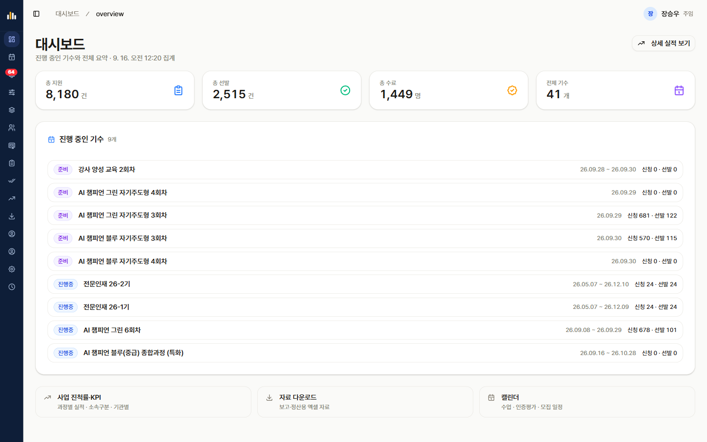
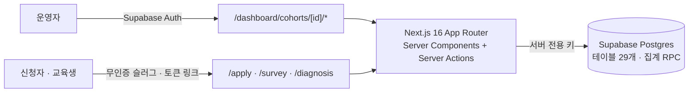

# KBrain EMS — 교육 운영 관리 시스템 사례

행안부 · NIA AI 챔피언 사업의 교육 운영 사이클 전체(모집 → 선발 → 수업 → 출결 → 과제 → 수료 → 인증 → 설문 → 진단 → 결과보고)를 한 시스템으로 옮긴 사내 운영 시스템. 2026년 4월부터 운영 중.

> **소스는 회사 자산이라 비공개입니다.** 이 저장소는 무엇을 · 왜 · 어떻게 만들었는지 기록한 사례 문서이며, 실행 가능한 코드는 포함하지 않습니다. 코드는 면접 등에서 화면 공유로 설명할 수 있습니다.

## 배경과 문제

처음에는 엑셀과 구글폼으로 운영했다. 기수가 하나일 때는 그걸로 충분했다.
사업이 확대되어 기수가 동시에 여러 개 돌아가고 운영자도 늘어나면서 세 가지가 무너졌다.

- **같은 데이터가 여러 파일에 흩어졌다.** 신청 명단, 출결표, 과제 제출 현황, 수료 판정표가 각각 다른 파일이었고, 기수가 겹치면 파일 수가 배로 늘었다.
- **판정이 사람 손에 의존했다.** 수료 판정처럼 출결과 과제를 합쳐 계산하는 일은 매번 담당자가 맞췄고, 담당자마다 결과가 달랐다.
- **선발이 병목이었다.** 신청자 수백 명을 역량 점수와 서술형 활용계획으로 평가해 소속 유형별로 배분하는 일을 엑셀에서 손으로 했다.

이 시스템은 그 운영을 직접 하는 사람이 만들었다. 수료 기준, 출결 인정 범위, 인증 조건, 선발 규칙 같은 도메인 규칙은 별도 요구사항 정리 없이 운영하면서 이미 알고 있던 것을 코드로 옮겼다.

## 요구사항

운영자 관점에서 정한 것.

1. 운영자는 기수를 먼저 고른 뒤 그 기수의 모든 도메인을 한 화면 체계에서 관리한다.
2. 신청자와 교육생은 계정 없이 링크 하나로 신청서 · 설문 · 진단에 응답한다. 공무원 수백 명에게 회원가입을 시킬 수 없다.
3. 선발은 규칙을 코드로 고정하되, 최종 결정은 운영자가 확인한다.
4. 만족도 설문은 누가 냈는지와 무엇을 냈는지를 분리해 저장한다.
5. 결과보고서는 운영 데이터에서 자동 초안이 나온다.

## 설계 결정

| 결정 | 요약 |
|---|---|
| 기수 중심 라우팅 | 모든 운영 화면이 `/cohorts/[id]/...` 아래. 교육생 명단은 출결 · 과제 등 모든 도메인이 공유하는 마스터 |
| 단계 기반 사이드바 | 기수의 모집 기간 · 교육 기간으로 `모집 중 → 진행 → 종료` 단계를 계산하고, 단계에 맞는 메뉴만 보여준다 |
| 무인증 토큰 링크 | 신청 · 설문 · 진단 응답은 슬러그 또는 토큰 링크로. 설문은 개별 토큰과 카톡 공유용 짧은 코드 두 가지 |
| 설문 응답 익명화 | 응답 내용과 "누가 완료했나"를 다른 테이블에 둔다. 제출 후 응답에서 학생 식별자를 지운다 |
| 자동 선발 + 운영자 승인 | 역량 점수 + 서술형 정성평가로 점수화, 사전학습 이수 우선 정렬, 소속 유형별 쿼터와 기관당 상한, 동점자 구제. 결과는 운영자가 확인 후 적용 |
| AI 보조 채점의 범위 | 서술형 활용계획 채점에 LLM을 쓰되 "1차 보조 채점 + 운영자 최종 승인"으로 한정. 규제 · 학술 근거를 먼저 정리했다 |
| 집계는 DB 함수로 | 자주 쓰는 통계는 Postgres RPC로 제공. 클라이언트 라이브러리가 GROUP BY를 지원하지 않아서다 |

각 결정의 상황 · 이유 · 트레이드오프는 [docs/decisions.md](docs/decisions.md).

## 아키텍처

구성 요소, 데이터 모델 개요, 인증 흐름은 [docs/architecture.md](docs/architecture.md).

## 결과 · 규모

2026-09-16 운영 대시보드 기준. 2026년 시스템 도입 후 집계이며 이전 엑셀 · 구글폼 데이터는 이관하지 않았다.

| 항목 | 값 |
|---|---|
| 누적 기수 | 41개 (동시 진행 9개) |
| 누적 지원 | 8,180건 |
| 누적 선발 | 2,515건 |
| 누적 수료 | 1,449명 |
| 운영자 | 10명 이상 |
| 데이터 | 테이블 29개, 마이그레이션 90개 |

## 배운 것과 남은 과제

- **운영자가 만들면 요구사항 단계가 사라진다.** 대신 "내가 아는 것이 전부"라는 위험이 생긴다. 다른 운영자가 쓰기 시작한 뒤 화면 문구와 절차를 여러 번 고쳤다.
- **익명화는 처음부터 스키마에 넣어야 한다.** 설문 응답 익명화는 나중에 마이그레이션으로 넣었고, 기존 응답을 옮기는 비용이 컸다.
- **남은 과제.** 행 단위 접근 제어(RLS) 정책이 아직 없어 모든 DB 접근이 서버 전용 키로 이루어진다. 자동화 테스트도 아직 없다. 둘 다 2026년 하반기 보강 항목이다.

## 스택

Next.js 16 (App Router) · React · TypeScript · Tailwind + shadcn/ui · TanStack Query / Form · Zod · Supabase (Postgres + Auth) · Bun · Vercel
