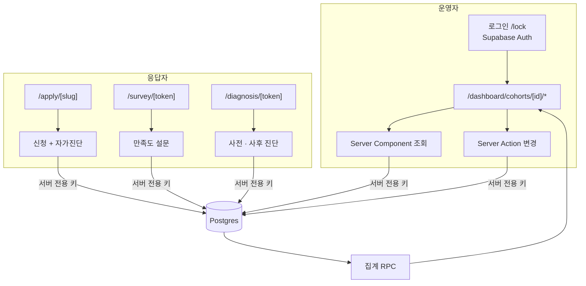

# 아키텍처

## 구성

```
frontend/              Next.js 16 (App Router) — 모든 애플리케이션 코드
supabase/migrations/   DB 스키마. raw SQL, 90개
docs/                  기획 · 산출물 (비공개)
```

별도 백엔드 서버가 없다. 데이터 변경은 페이지 옆에 두는 Server Action이 담당하고, 조회는 Server Component가 직접 한다.

## 데이터 흐름



- 운영자 페이지는 세션 확인 후 서버 전용 키로 DB에 접근한다.
- 응답 페이지는 슬러그 · 토큰을 서버에서 검증한 뒤 같은 경로로 저장한다.
- 브라우저는 DB에 직접 붙지 않는다.

## 라우트

| 구역 | 라우트 | 역할 |
|---|---|---|
| 기수별 운영 | `/dashboard/cohorts/[id]/students` | 교육생 명단 (모든 도메인의 마스터) |
| | `.../recruitment` `.../selection` | 모집, 선발 |
| | `.../lessons` `.../attendance` `.../assignments` | 수업 회차, 출결, 과제 |
| | `.../completion` `.../certification` | 수료, 인증 |
| | `.../instructors` | 강사 배정 · 강사료 |
| | `.../surveys` `.../diagnoses` | 만족도 설문, 사전 · 사후 진단 |
| | `.../reports` `.../notifications` `.../dashboard` | 결과보고서 초안, 알림 발송 로그, 회차별 통계 |
| 전역 | `/dashboard/applicants` `/instructors` `/evaluators` | 지원자 마스터, 강사풀, 평가위원 |
| | `/dashboard/kpi-dashboard` `/risks` `/issues` `/operators` | KPI, 리스크, 이슈, 운영자 관리 |
| 공개 응답 | `/apply/[slug]` `/survey/[token]` `/survey/share/[code]` `/diagnosis/[token]` | 무인증 |

## 데이터 모델 개요

테이블 29개. 군으로 묶으면 다음과 같다.

| 군 | 테이블 | 비고 |
|---|---|---|
| 조직 · 기수 | operators, cohorts, organizations, tracks, locations | cohorts에 모집 · 교육 기간 (단계 산출 입력) |
| 신청 · 선발 | applicants, applications, evaluators, evaluations | applications = 지원자 × 기수, 자가진단 · 첨부 포함 |
| 교육생 · 수업 | students, sessions, attendance_records, assignments, assignment_submissions | students는 applicant 승격이지만 독립 id |
| 강사 | instructors, instructor_grades, session_instructors, instructor_fees | 등급 단가 → 강사료 산정 · 승인 |
| 설문 · 진단 | surveys, survey_questions, survey_responses, survey_completions, diagnoses, diagnosis_questions, diagnosis_responses | 응답과 완료 추적 분리 (익명화) |
| 운영 | cohort_reports, notifications, risks, issues | 결과보고서 초안 상태: draft → reviewed → finalized |

## 인증과 권한

- 운영자는 Supabase Auth(이메일 · 비밀번호). 운영자 테이블이 auth 사용자와 1:1로 매핑된다.
- 권한 게이트는 서버 헬퍼 두 개(`현재 운영자 조회`, `개발자 여부`)로 단일화했다. 지금은 "운영자 행이 있다"가 곧 접근 허용이고, 역할 분리가 필요해지면 이 함수만 좁히면 된다.
- 행 단위 접근 제어(RLS) 정책은 아직 없다. 모든 테이블이 RLS 활성 상태라 anon 키는 전부 거부되고, 서버만 서버 전용 키로 접근한다.

## 개인정보

- 실명 · 연락처가 담긴 명단, 덤프, 엑셀은 저장소에 커밋하지 않는다(gitignore).
- 로컬 개발용 시드는 실제 교육생 데이터를 익명화한 것으로, 이름은 가명이고 생년월일은 비어 있다.
- 설문 응답은 제출 시점에 학생 식별자를 지운다.

## 운영

- 배포는 Vercel, DB는 Supabase Cloud.
- 마이그레이션은 raw SQL 파일로 기록하고 순서대로 적용한다.
- 테스트 스위트는 아직 없다. 변경 검증은 lint · build와 실제 화면 확인으로 한다.
